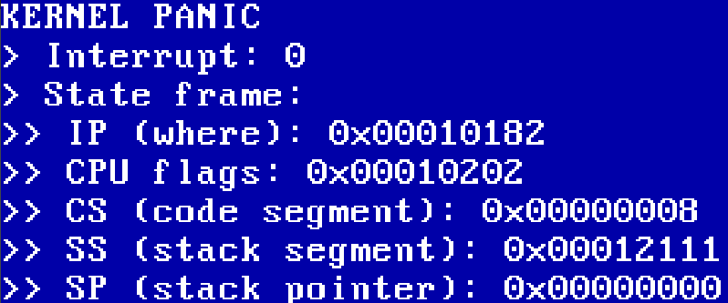

# SOS - kernel

Basic bootloader & kernel (x86 32bit)

 
***
 
Now:
- the bootloader starts the kernel
- the kernel write a basic message via VGA
- IDT table for legacy intel interruptions
- IDT table for PIC (keyboard & IO)
- currently, print out the scancode in hex of the typed key (no scrolling on VGA yet, coming soon)
- dumb bump memory allocator for a basic heap, no free yet
- frame allocator to segment free memory (after the heap) into blocks of 4kb
- paging for virtual memory addresses, with, for the kernel its own page directory, required for future processes isolation in memory

Coming:
- Processes and scheduling
- Video acceleration for better visual
- A basic shell interface with some programs built-in
- Syscalls interface for future userspace 

See [Makefile](Makefile) to build the image and run it with QEMU.

You will need few things to run it:
- `i686-elf-gcc` to compile the kernel
- `nasm` to assemble the bootloader
- `i686-elf-ld` for the linker
- QEMU to run everything
